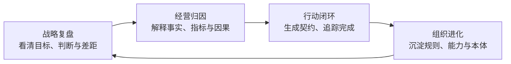
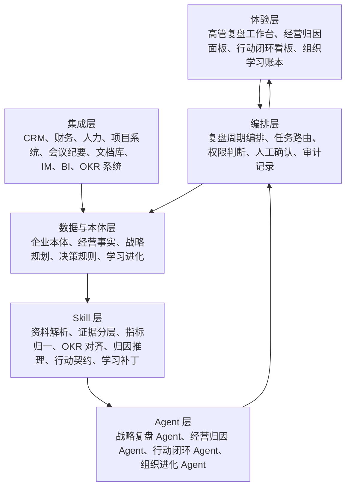
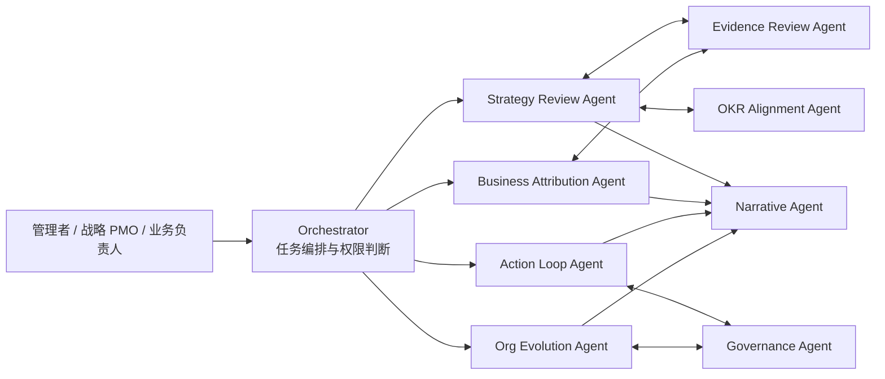
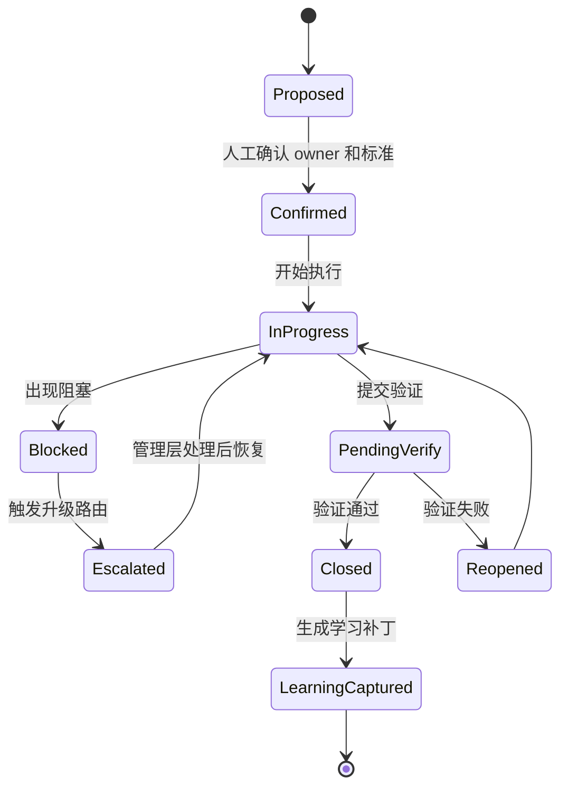
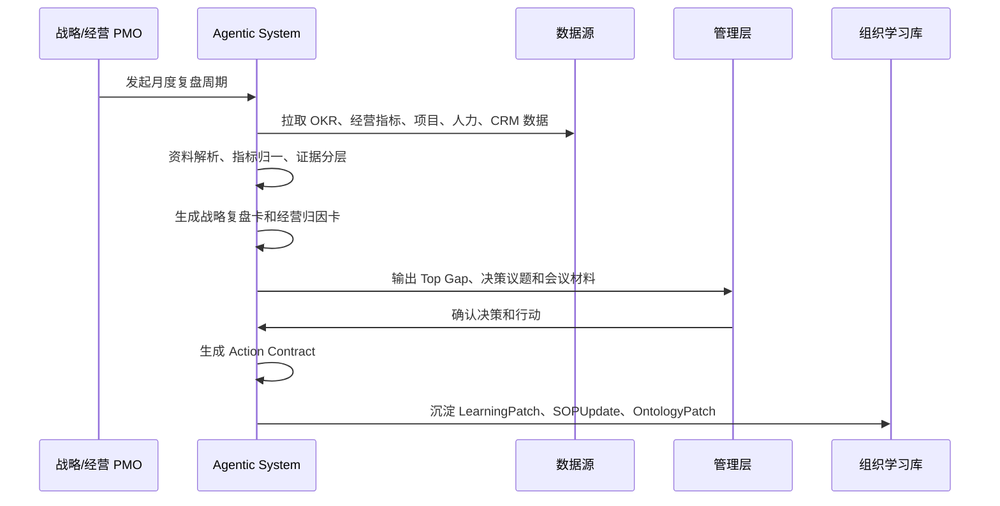

# Horizon 大观战略管理与运营闭环 Agentic System 详细设计文档

版本：v0.1
日期：2026-06-14
归属产品：Horizon 大观
适用范围：官网场景页、产品方案、客户沟通、内部研发拆解、售前方案与原型设计

---

## 1. 文档目的

本文把官网场景页中“战略管理与运营专家团”的表达，进一步整理成一套完整的 Agentic System 设计说明。

当前页面上的核心定位是：

> 把企业事实、OKR、经营数据与复盘行动接入同一条管理闭环，围绕战略复盘、经营归因、行动闭环和组织进化推动管理升级。

这不是一个简单的“战略报告生成器”，也不是一个“经营数据看板”。它是一套面向企业高管、战略部门、经营管理部门和业务负责人使用的 AI 原生管理系统：把企业战略、经营事实、跨部门行动和组织学习转化为可被 Agent 持续处理、验证、追踪和进化的管理闭环。

---

## 2. 一句话定义

**Horizon 大观战略管理与运营闭环 Agentic System，是一套面向企业管理层的 AI 原生经营操作系统。它以战略复盘为入口，以经营归因为判断引擎，以行动闭环为执行抓手，以组织进化为学习机制，把“听汇报、开复盘会、拍行动项”升级为可追踪、可验证、可复用、可进化的 Agentic 管理系统。**

---

## 3. 为什么需要这套系统

### 3.1 传统战略管理的问题

企业并不缺少战略、OKR、经营会议和报表。真正的问题通常发生在这些对象之间没有形成闭环：

| 传统管理对象 | 常见问题 | 系统需要解决的问题 |
|---|---|---|
| 战略 | 写在 PPT 和年度材料里，难以进入日常经营 | 战略如何进入周/月度复盘和具体行动 |
| OKR | 目标被填写，但与真实业务事实脱节 | OKR 是否被证据支撑，是否出现偏离 |
| 经营数据 | 各部门口径不同，会议先“对数”再讨论 | 如何形成单一可信源和归因判断 |
| 会议纪要 | 讨论很多，但行动项不清、责任不清 | 如何把判断转成 owner、deadline 和验证标准 |
| 复盘 | 复盘停留在解释结果，学习难沉淀 | 如何沉淀 SOP、本体、规则、能力地图和 Skill 评测 |
| 组织能力 | 依赖个人经验和隐性判断 | 如何把优秀判断转成组织可复用资产 |

### 3.2 AI 原生管理的关键变化

AI 原生管理不是“把报告自动写出来”，而是把管理中的核心对象变成机器可处理的结构：

- 把会议材料拆成事实、主张、假设、证据、风险和行动。
- 把 OKR、指标、项目、客户信号、人力能力和财务数据接入同一语义层。
- 把高管判断拆成可复盘的 Issue、Decision、ActionItem 和 LearningPatch。
- 把复盘结果沉淀为 SOP、规则、本体更新、模板、技能评测和组织能力地图。
- 把 Agent 从“回答问题”升级为“持续维护经营闭环”。

---

## 4. 系统边界

### 4.1 它是什么

这套系统是一个面向战略与经营管理的多 Agent 协作系统，主要负责：

1. 汇聚企业事实、OKR、经营指标、客户信号、项目进度、人力能力和复盘行动。
2. 对业务事实进行证据审查、口径校准和因果归因。
3. 组织公司级、部门级和专项战役级战略复盘。
4. 将复盘结论转化为可执行的行动契约。
5. 追踪行动闭环，识别阻塞、升级和重复问题。
6. 把每轮经营复盘沉淀成组织学习资产。

### 4.2 它不是什么

| 不是 | 原因 |
|---|---|
| 不是一个普通聊天机器人 | 重点不是回答单次问题，而是维护跨周期管理对象 |
| 不是一个 BI 看板 | BI 展示数据，系统还要完成证据、判断、行动和学习 |
| 不是一个 OA 流程工具 | 它不仅流转审批，还要解释业务事实和管理因果 |
| 不是一个纯 OKR 工具 | OKR 只是锚点，系统还处理经营事实、行动和组织学习 |
| 不是替代高管决策 | AI 提议、整理、校验和追踪，人保留关键裁决权 |

---

## 5. 核心闭环

系统的核心总结为四个方面：

### 5.1 战略复盘

目标：把公司级核心判断、OKR 进展、证据缺口、Top Gap 和跨部门机制聚合到一屏，形成可执行的战略判断。

典型问题：

- 当前战略是否仍然成立？
- 哪些目标偏离不是执行问题，而是战略假设问题？
- 哪些部门数据相互矛盾？
- 哪些跨部门机制正在阻碍战略落地？
- 哪些高优问题必须进入管理层决策？

核心产出：

- 公司级战略复盘简报
- OKR 偏离与证据缺口清单
- Top Gap 列表
- 战略假设更新
- 决策议题卡
- 管理层复盘议程

### 5.2 经营归因

目标：接入指标、CRM、财务、人力和项目系统，统一口径并标记背离、风险与因果线索，让会议从“对数”变成“做判断”。

典型问题：

- 收入、毛利、转化、交付、人效、库存或客户满意度变化，到底由什么驱动？
- 数据异常是口径问题、系统问题、执行问题还是市场问题？
- 哪些指标变化已经可以形成判断，哪些还只是信号？
- 哪些部门叙事缺少证据，哪些判断被事实反驳？

核心产出：

- 单一可信指标表
- 指标口径差异记录
- 经营归因卡
- 风险信号清单
- 证据强度标签
- 因果假设列表

### 5.3 行动闭环

目标：把复盘建议转成 owner、deadline、验证标准和升级路由，形成跨部门行动队列并持续追踪完成质量。

典型问题：

- 复盘会后到底谁负责什么？
- 行动是否有清晰成功标准？
- 哪些行动已经逾期，为什么逾期？
- 哪些问题需要升级到高管或跨部门机制？
- 哪些行动重复出现，说明组织机制没有改变？

核心产出：

- 行动契约 Action Contract
- owner / deadline / verifier
- 验证标准和验收方式
- 升级路由
- 行动质量评分
- 未闭环原因分析

### 5.4 组织进化

目标：把执行结果沉淀为 SOP、规则、本体更新、能力地图和 Skill 评测，让组织能力随业务复盘持续升级。

典型问题：

- 这次复盘教会了组织什么？
- 哪些规则、SOP、模板或指标口径需要更新？
- 哪些岗位能力缺口影响了战略执行？
- 哪些 Agent Skill 需要增加评测样例或优化提示词？
- 哪些经验应被复用到下一个业务周期？

核心产出：

- LearningPatch
- SOPUpdate
- OntologyPatch
- SkillEvalCase
- 能力地图更新
- 组织进化报告

---

## 6. 总体系统架构

### 6.1 六层架构

### 6.2 关键设计原则

1. **先抓事实，再生成叙事**
   系统先抽取事实、指标、证据、风险和行动，再生成报告和总结。

2. **以 OKR 和战略假设为锚点**
   报告不是任务流水账，而是围绕目标、关键结果、偏差和策略尝试展开。

3. **区分事实、主张和假设**
   自我报告不能直接当证据。系统必须显式标注证据强度。

4. **行动必须可验证**
   每个行动都需要 owner、deadline、成功标准、验证人和升级路由。

5. **每轮复盘都要沉淀学习**
   没有 LearningPatch 的复盘是不完整的。

6. **人在闭环，可治理**
   AI 负责整理、提示、校验和追踪。高风险决策由人确认。

---

## 7. Agent 体系

### 7.1 核心 Agent 编制

| Agent | 使命 | 主要输入 | 主要输出 | 人工确认点 |
|---|---|---|---|---|
| Strategy Review Agent | 组织战略复盘，识别目标偏离、证据缺口和管理议题 | 战略、OKR、经营数据、会议纪要、周/月报 | 战略复盘卡、Top Gap、决策议题 | 战略判断、资源取舍 |
| Business Attribution Agent | 对经营指标变化做口径校准和归因分析 | CRM、财务、人力、项目、BI、业务叙事 | 归因卡、风险信号、口径差异 | 重大归因结论 |
| Evidence Review Agent | 审查事实、主张、假设和证据强度 | 文档、表格、纪要、系统数据 | Evidence Graph、证据标签、缺证提醒 | 关键证据采信 |
| OKR Alignment Agent | 检查 OKR 与战略、事实和行动的对应关系 | 公司 OKR、部门 OKR、行动计划 | OKR 对齐图、偏离提示、贡献映射 | OKR 调整建议 |
| Action Loop Agent | 把复盘结论转为行动契约并追踪闭环 | 决策结论、问题卡、责任人、项目系统 | ActionItem、进度状态、升级提醒 | 关键行动承诺 |
| Org Evolution Agent | 把复盘和行动结果沉淀为组织能力资产 | 完成记录、复盘结论、绩效结果、能力数据 | SOPUpdate、LearningPatch、能力地图 | 组织规则变更 |
| Governance Agent | 管理权限、版本、审计和风险边界 | 用户身份、数据权限、操作记录 | 审计日志、权限判断、风险提示 | 敏感数据访问 |
| Narrative Agent | 生成高管简报、复盘材料和对齐说明 | 所有结构化对象 | Brief、PPT 大纲、会议材料 | 对外或董事会材料 |

### 7.2 Agent 协同关系

### 7.3 Agentic System 的关键差异

普通 Agent 解决一次对话。Agentic System 需要持续维护对象状态：

- 一个 Issue 会跨越多个会议、行动和验证周期。
- 一个 ActionItem 有状态机，而不是一句“已安排”。
- 一个 Decision 有上下文、反证、替代方案、风险和生效条件。
- 一个 LearningPatch 会更新 SOP、本体或 Skill Eval。
- 一个指标口径会被复用到之后所有复盘周期。

---

## 8. 核心数据对象

### 8.1 管理对象总览

| 对象 | 说明 | 关键字段 |
|---|---|---|
| StrategyTheme | 战略主题 | name、cycle、priority、owner、status |
| OKR | 目标与关键结果 | objective、kr、baseline、target、current、confidence |
| MetricFact | 带时间戳的经营事实 | metric、value、period、source、owner、quality |
| Evidence | 事实、主张、假设及证据 | type、claim、source、strength、contradiction |
| Issue | 管理问题 | symptom、root_cause、impact、scope、urgency |
| Hypothesis | 经营假设 | assumption、expected_signal、validation_method、expiry |
| Decision | 决策记录 | options、decision、rationale、risk、decider、date |
| ActionItem | 行动项 | owner、deadline、success_criteria、verifier、status |
| ReviewCycle | 复盘周期 | cadence、participants、input_pack、output_pack |
| LearningPatch | 学习补丁 | lesson、target_object、update_type、approval_status |
| SOPUpdate | 流程更新 | before、after、owner、effective_date |
| OntologyPatch | 本体更新 | concept、relation、rule、reason、evidence |
| SkillEvalCase | Agent Skill 评测样例 | skill、input、expected_output、risk_level |
| CapabilityGap | 组织能力缺口 | role、capability、gap、training_action、owner |
| RiskSignal | 风险信号 | signal、source、severity、trigger、response_plan |

### 8.2 ActionItem 状态机

### 8.3 Evidence 强度分层

| 证据等级 | 定义 | 示例 |
|---|---|---|
| E0 未证实 | 只有主观判断或口头描述 | “客户可能不满意” |
| E1 弱证据 | 有个别案例或非权威记录 | 单个销售反馈 |
| E2 中证据 | 有多来源材料，但口径未完全统一 | CRM + 会议纪要 |
| E3 强证据 | 来自权威系统，有清晰口径和时间戳 | 财务系统、项目系统、已确认 OKR 数据 |
| E4 复核证据 | 多系统一致，已被负责人确认 | 财务 + CRM + 业务负责人签核 |

系统默认不把 E0/E1 直接作为高风险决策依据。

---

## 9. 五层认知底座

战略管理与运营闭环需要企业本体支持。这里的本体不是企业百科，而是管理判断的认知底座。

| 层级 | 回答的问题 | 典型对象 |
|---|---|---|
| 企业本体层 | 我是谁，如何理解世界 | CompanyContext、CustomerSegment、ProductCapability、OrgUnit、CultureAssumption |
| 企业现实状态层 | 我现在在哪里 | MetricFact、RevenueSnapshot、PipelineSnapshot、HeadcountSnapshot、RiskSignal |
| 战略与规划层 | 我要到哪里去 | Vision、Battlefield、NonGoal、StrategicAssumption、OKR、Initiative |
| 决策规则与风格层 | 我如何判断、取舍和授权 | DecisionRule、Preference、Guardrail、ApprovalPolicy、DecisionJournal |
| 学习进化层 | 我学到了什么 | LearningPatch、OntologyPatch、SOPUpdate、SkillEvalCase、AssumptionUpdate |

关键原则：

- 本体沉淀概念、关系、规则和阶段判断。
- 经营数据沉淀带时间戳的事实状态。
- 二者必须连接，但不能混在一起。
- 同样的指标变化，在不同公司阶段、行业、战略取舍下，管理含义可能完全不同。

---

## 10. Skill 体系

### 10.1 P0 Skill

| Skill | 目标 | 典型输入 | 典型输出 |
|---|---|---|---|
| `source-manifest-builder` | 建立资料来源清单 | 文档、会议纪要、表格、系统导出 | Source Manifest |
| `report-reality-capture` | 从报告和纪要中抽取事实 | 周报、月报、复盘材料 | Fact、Claim、Hypothesis |
| `evidence-status-labeler` | 给事实和主张打证据标签 | 文档、系统数据、截图 | Evidence Label |
| `metric-canonicalizer` | 统一指标口径 | CRM、财务、BI、人力数据 | 指标字典、口径差异 |
| `okr-progress-reviewer` | 检查 OKR 进展和偏离 | 公司/部门 OKR、经营事实 | OKR Progress Card |
| `business-attribution-analyst` | 形成经营归因判断 | 指标变化、业务事件、客户信号 | Attribution Card |
| `action-contract-writer` | 把结论转成行动契约 | 决策、问题、责任人 | Action Contract |
| `risk-escalation-router` | 识别升级事项 | 阻塞、逾期、高风险动作 | Escalation Card |
| `learning-patch-writer` | 把复盘结果沉淀为学习补丁 | 行动结果、复盘结论 | LearningPatch |
| `executive-brief-generator` | 生成高管复盘材料 | 所有结构化对象 | Brief、会议议程 |

### 10.2 P1 Skill

| Skill | 目标 |
|---|---|
| `prior-action-auditor` | 审查上一轮行动是否真正闭环 |
| `strategy-experiment-summarizer` | 总结 O 与 KR 之间的策略实验 |
| `first-principles-decomposer` | 对关键问题做第一性原理拆解 |
| `system-causality-writer` | 形成跨部门因果图 |
| `capability-gap-miner` | 从行动结果和岗位表现识别能力缺口 |
| `department-review-pack-builder` | 生成部门复盘包 |
| `decision-boundary-checker` | 检查事项是否触碰战略边界或权限边界 |

### 10.3 P2 Skill

| Skill | 目标 |
|---|---|
| `ontology-patch-writer` | 更新企业本体中的概念、关系和规则 |
| `sop-update-proposer` | 提出流程和 SOP 更新 |
| `skill-eval-case-builder` | 把失败案例转成 Agent 评测样例 |
| `roin-weekly-evaluator` | 评估智能投入回报 |
| `culture-assumption-miner` | 从重复问题中挖掘组织文化假设 |
| `leverage-point-ranker` | 排序真正有杠杆的组织改进点 |

---

## 11. 关键业务流程

### 11.1 月度公司级战略复盘

步骤：

1. 发起复盘周期，确定周期、范围、参与人和输入材料。
2. 收集 OKR、经营指标、项目进度、客户信号、人力数据和会议材料。
3. 构建 Source Manifest，标注资料来源、更新时间和可信度。
4. 抽取事实、主张、假设、风险、行动和待确认问题。
5. 做指标口径统一和跨系统数据对账。
6. 生成战略复盘卡、经营归因卡、行动闭环卡和组织学习卡。
7. 管理层确认关键判断和高风险行动。
8. 系统追踪行动，并在下一周期自动审查闭环质量。

### 11.2 经营指标异常归因

触发条件：

- 核心指标超出阈值。
- 数据与部门叙事冲突。
- OKR 进展明显偏离。
- 同一指标在多个系统中不一致。

流程：

1. Business Attribution Agent 识别异常指标。
2. Metric Canonicalizer 检查口径、时间窗口和数据源。
3. Evidence Review Agent 检查相关证据。
4. Attribution Analyst 构建候选原因。
5. 系统输出归因结论、证据强度和待验证假设。
6. 管理者确认是否进入行动闭环或继续观察。

### 11.3 会议到行动闭环

输入：

- 会议纪要
- 录音转写
- 复盘结论
- 管理者口头判断

流程：

1. 系统抽取议题、决策、分歧、待确认事项和行动。
2. 对每个行动补齐 owner、deadline、success criteria、verifier。
3. 检查行动是否过宽、不可验证或缺少升级路由。
4. 生成行动契约。
5. 同步到项目系统、IM 或任务系统。
6. 到期前提醒，到期后验证，未闭环自动升级。

### 11.4 组织进化沉淀

触发条件：

- 行动完成并被验证。
- 行动失败但产生明确学习。
- 同类问题重复出现。
- 指标口径、SOP 或组织规则需要更新。

输出：

- 哪条假设被证实或证伪。
- 哪个 SOP 需要更新。
- 哪个本体概念或关系需要调整。
- 哪个岗位能力需要补强。
- 哪个 Agent Skill 需要新增评测样例。

---

## 12. 产品形态

### 12.1 高管复盘工作台

用途：让管理层在一屏里看到公司级战略判断。

核心模块：

- 战略主题与 OKR 进展
- Top Gap
- 证据缺口
- 经营归因摘要
- 跨部门机制问题
- 待决策事项
- 本轮行动闭环状态

### 12.2 经营归因面板

用途：让会议从“对数”转向“判断”。

核心模块：

- 指标变化
- 权威数据源
- 口径差异
- 业务事件时间线
- 候选归因
- 证据强度
- 待验证假设

### 12.3 行动闭环看板

用途：把复盘结论变成组织执行。

核心模块：

- Action Contract
- owner / deadline / verifier
- 进度状态
- 阻塞原因
- 升级路由
- 验证结果
- 行动质量评分

### 12.4 组织学习账本

用途：把经验变成组织资产。

核心模块：

- LearningPatch
- SOPUpdate
- OntologyPatch
- SkillEvalCase
- 能力缺口
- 复用建议
- 组织进化趋势

---

## 13. 权限与治理

### 13.1 权限分层

| 角色 | 可访问内容 | 典型权限 |
|---|---|---|
| CEO / 核心高管 | 全公司经营、战略、组织与敏感归因 | 读取、确认、裁决、发布 |
| 战略 / 经营 PMO | 复盘材料、行动闭环、跨部门问题 | 读取、编排、追踪、建议 |
| 部门负责人 | 本部门数据、行动、OKR、跨部门依赖 | 读取、确认、反馈 |
| HR / 组织发展 | 组织能力、岗位能力、培训与人才缺口 | 读取受限、沉淀能力资产 |
| 一线成员 | 与本人任务相关的行动和反馈 | 读取个人相关、提交反馈 |
| Agent / 系统 | 按最小权限读取和生成结构化对象 | 不做最终裁决 |

### 13.2 人在闭环

必须人工确认的事项：

- 战略方向调整
- 资源取舍
- 高风险归因结论
- 涉及个人评价的人才判断
- 对外发布材料
- 组织规则和 SOP 正式变更
- 可能引起部门冲突的升级事项

### 13.3 审计要求

系统应记录：

- 数据来源
- Agent 处理过程
- 使用的模型和 Skill 版本
- 人工确认人
- 决策时间
- 变更对象
- 输出版本
- 后续行动状态

---

## 14. 评测与质量标准

### 14.1 Agent 输出质量

| 质量维度 | 标准 |
|---|---|
| 准确性 | 不编造数据，不混用版本，不把假设说成事实 |
| 可解释性 | 说明判断依据、证据强度和不确定性 |
| 可执行性 | 输出明确 owner、deadline、验证标准 |
| 可治理性 | 标注权限边界和人工确认点 |
| 可复用性 | 产出能沉淀为模板、SOP、本体或 Skill Eval |
| 抗漂移 | 与战略、OKR 和已确认口径保持一致 |

### 14.2 系统验收指标

| 指标 | 定义 | 目标方向 |
|---|---|---|
| 复盘准备时间 | 从收集材料到生成复盘包的时间 | 下降 |
| 证据覆盖率 | 关键判断中有 E2 以上证据支撑的比例 | 上升 |
| 行动闭环率 | 按期完成并通过验证的行动比例 | 上升 |
| 会议对数时间 | 经营会议中用于对齐数字口径的时间 | 下降 |
| 决策议题清晰度 | 会议前明确选项、反证、风险和责任人的议题比例 | 上升 |
| 重复问题率 | 同类问题跨周期重复出现的比例 | 下降 |
| LearningPatch 产出率 | 每轮复盘沉淀为组织学习资产的比例 | 上升 |
| ROIn | 单位智能投入带来的决策、行动和学习增量 | 上升 |

---

## 15. 实施路线图

### 15.1 0 到 30 天：复盘材料自动化

目标：

- 建立 Source Manifest。
- 从周报、月报、会议纪要和系统导出中抽取事实、主张、假设、行动。
- 自动生成基础复盘包。

验收：

- 复盘准备时间明显下降。
- 每份复盘材料都有证据标签。
- 关键行动都有 owner、deadline 和验证标准。

### 15.2 30 到 60 天：OKR 和经营数据对齐

目标：

- 接入公司/部门 OKR。
- 接入核心经营指标。
- 实现指标口径统一和初步归因。

验收：

- 能自动标出 OKR 偏离。
- 能发现数据口径冲突。
- 能输出经营归因卡。

### 15.3 60 到 90 天：行动闭环和升级路由

目标：

- 建立行动状态机。
- 打通任务系统或 IM 提醒。
- 建立升级规则。

验收：

- 行动闭环率可被统计。
- 逾期和阻塞能自动提示。
- 重大问题能进入管理层议题池。

### 15.4 90 到 180 天：组织学习沉淀

目标：

- 建立 LearningPatch、SOPUpdate、OntologyPatch。
- 建立能力地图和 SkillEvalCase。
- 将重复问题转成组织能力改进。

验收：

- 每轮复盘都有学习资产。
- 重复问题率下降。
- Agent 评测样例持续增加。

### 15.5 180 天以上：公司级 Agentic Operating System

目标：

- 多 Agent 协同稳定运行。
- 本体和经营事实持续更新。
- 低风险行动自动推进，高风险行动人工确认。
- 形成可复用的行业模板和客户交付方法。

验收：

- 系统不只生成报告，而是持续维护经营闭环。
- 战略复盘、经营归因、行动闭环和组织进化成为统一工作流。
- Horizon 大观具备产品化复制能力。

---

## 16. 与官网页面表达的对应关系

| 官网表达 | 系统内涵 |
|---|---|
| 战略管理与运营专家团 | 面向战略与经营闭环的多 Agent 编队 |
| Horizon 大观 | 承载该能力的产品系统 |
| 战略复盘 | 公司级目标、假设、证据、Gap 和决策议题管理 |
| 经营归因 | 指标统一、证据审查、风险识别和因果判断 |
| 行动闭环 | owner、deadline、验证标准、状态追踪和升级路由 |
| 组织进化 | SOP、本体、能力地图、Skill Eval 和 LearningPatch |
| AI 管理闭环 | 从事实到判断、从判断到行动、从行动到学习的持续循环 |

---

## 17. 客户沟通版本

### 17.1 30 秒版本

Horizon 大观的战略管理与运营闭环，把企业战略、OKR、经营数据和复盘行动接到同一套 AI 管理系统里。它不只是生成经营报告，而是用 Agent 持续完成战略复盘、经营归因、行动闭环和组织进化，让管理层更快看清真实问题，更快形成判断，更稳定推动组织执行。

### 17.2 3 分钟版本

企业管理最难的地方不是缺少报表，也不是缺少会议，而是战略、数据、判断、行动和学习之间没有闭环。很多复盘会先花大量时间对齐数字，再凭经验讨论原因，最后形成一批行动项，但行动是否完成、是否有效、是否沉淀为组织能力，往往没有持续追踪。

Horizon 大观把这一整条链路 Agentic 化。系统先把企业事实、OKR、经营指标、会议纪要和业务数据接入统一语义层，再由不同 Agent 分别完成战略复盘、经营归因、证据审查、行动契约和组织学习沉淀。管理层看到的不再只是“谁汇报得好”，而是哪些目标偏离、哪些判断有证据、哪些行动可验证、哪些问题反复出现、哪些经验应该升级成 SOP 或组织能力。

最终，企业不是多了一个 AI 报告工具，而是拥有一套可持续进化的 AI 管理闭环。

---

## 18. 待确认问题

1. 第一版产品应优先服务 CEO / 战略 PMO，还是先服务部门负责人？
2. 第一批外部系统接入优先级是什么：OKR、CRM、财务、人力、项目系统还是会议纪要？
3. 是否把“组织能力与人才技能升级”作为独立模块，还是归入“组织进化”？
4. 行动闭环是否需要直接打通客户现有任务系统，还是先在 Horizon 内闭环？
5. 哪些归因结论必须人工确认后才能进入复盘材料？
6. 客户部署时，企业本体和指标口径由谁维护：客户 PMO、Frontis FDE，还是双方共建？
7. 产品化交付中，哪些 Skill 属于通用能力，哪些需要按行业模板配置？

---

## 19. 下一步建议

1. 基于本文拆出 P0 原型范围：复盘材料自动化、证据标签、OKR 对齐、经营归因卡、行动契约。
2. 在 `scene.html` 当前视觉基础上，把右侧信息图对应成产品原型内容，而不仅是概念图。
3. 为售前准备一份 6 页方案版：问题、系统、四大闭环、Agent 编队、实施路线、价值指标。
4. 为研发准备对象模型和 API 草案：Issue、Evidence、Decision、ActionItem、LearningPatch。
5. 为客户 PoC 设计一个 30 天验证方案：从一次月度复盘开始，验证准备时间、行动闭环率和学习沉淀率。
